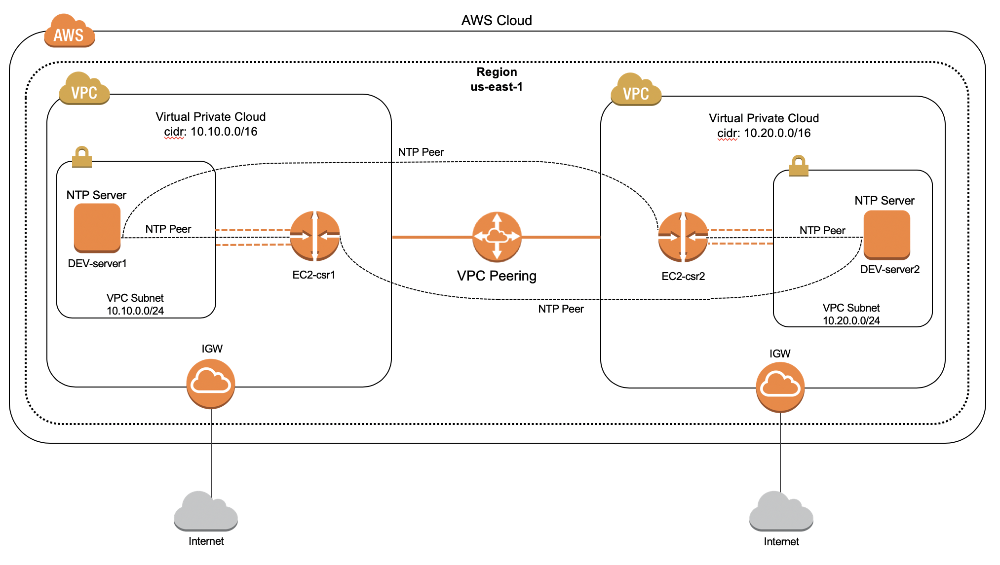

# aws-smu-project
AWS Automation of network infrastructure and components

The first playbook aws_ec2_playbook.yml will fully automate the creation of the networking and infrastructure components shown in figure below.  There is no manual configurations done within AWS marketplace.  Everything will be created via the Ansible playbook and any dynamic IP addresses will be updated via the Ansible playbook into corresponding YAML files for reference.  The configuration tasks will be done within a single Ansible playbook with multiple plays.  The playbook will create the following:

•	Create two VPCs within a single region

•	Create a single subnet within each VPC

•	Create security groups within each VPC

•	Create VPC peer between the VPCs

•	Create security keypair and download keypair to local system

•	Create Internet Gateway (IGW) for each VPC

•	Create VPC route tables for access to Internet and routes to each VPCs private subnet 

•	Create Ubuntu Linux servers within each VPC

•	Create Cisco CSR1kv routers within each VPC

The second playbook aws_device_configs.yml will provision the environment to support the NTP protocol on a Linux servers and the Cisco CSR1kv routers.  The playbook will first configure both Linux servers as an NTP server.  The playbook will then provision both Cisco CSR1kv routers with general baseline router configurations and provision the routers to point to the Linux servers acting as NTP Servers for network time services.  The playbook will then check to ensure both router’s clocks are synced with the NTP server.  

